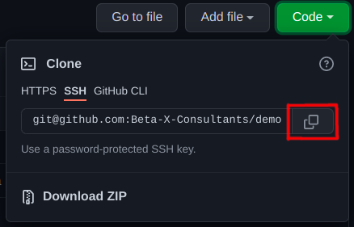
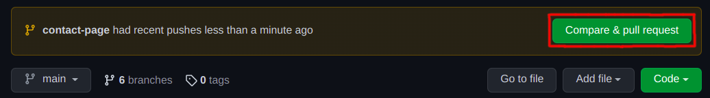
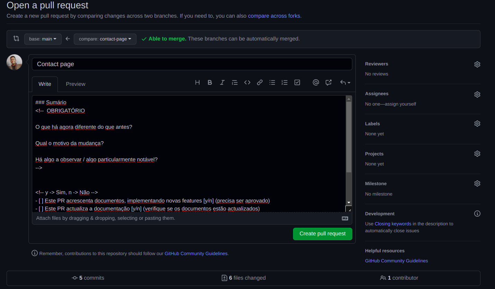

# Html Practice

A simple repository for demo tasks to **sharp your html skills** 😉.

### **Link para o acesso** da tarefa: [HTML Challenge](https://www.figma.com/design/COgQR0DqFdbMBZ9WsISwKS/Figma-Tutorial-For-Beginners?node-id=267-1465&t=hKziWO4R4UTslURV-1)
O design encontra-se no figma, no link acima.

<br>

## **COMO CONTRIBUIR PARA ESTE REPOSITÓRIO**

## 1. Clone o repositório

Clone este repositório para a tua máquina. Carrega no botão `"code"` e, em seguida, escolhe a opção `SSH` e copie a URL.




De seguida, abre o terminal e executa o seguinte comando:

```
git clone "URL"
```

Onde o `"link"` foi o copiado anteriormente (**sem as aspas**) é a URL deste repositório. Consulta as etapas anteriores para obter a URL.

Por exemplo:

```
git clone git@github.com:git@github.com:paytekafrica/html-practice.git
```

Aqui estás a copiar o conteúdo do repositório html-practice para o teu computador via ssh.

## 2. Cria um Branch

Vá para o diretório do repositório no teu computador (caso ainda não estejas lá):

```
cd html-practice/
```

De seguida faça um `git pull` para garantir actualização imediata ao repositório local para que os conteúdos sejam iguais:

```
git pull
```

De seguida, cria um Branch usando o comando `git checkout`:

```
git checkout -b <nome-da-branch>
```

Por exemplo:

```
git checkout -b contact-page
```

**Obs:** O nome do Branch não precisa de ter a sigla "page", mas neste caso é recomendável, porque a finalidade deste Branch é a de adicionar a sua página para o repositório.

## 3. Ecfetua as alterações necessárias e faz um Commit

Agora faça as adições e modificações necessárias no teu editor de código. Se fores para o diretório do projecto e executar o comando `git status`, verás que há alterações. Adiciona essas alterações ao Branch que acabaste de criar utilizando o comando `git add`:

```
git add <nome-do-ficheiro>
```

Agora faz um Commit dessas alterações utilizando o comando `git commit`:

```
git commit -m "Adicionei a contact page"
```

A mensagem deve ser curta e concisa em relação ao ficheiro adicionado.

## 4. Faz um Push das alterações para o GitHub

Faz um Push utilizando o comando `git push`:

```
git push origin <nome-da-branch>
```

ou

```
git push --set-upstream origin <nome-da-branch>
```

substitui `<nome-da-branch>` pelo nome da Branch que criaste anteriormente.

## 5. Envia as tuas alterações para serem revistas

Se fores para o teu repositório no GitHub, verás um botão `Compare & pull request`. Clica nesse botão.



Agora envia um Pull Request.




Assim a Pull Request está a espera de ser revista para que as tuas mudanças sejam integradas no Branch principal `main` deste projecto. Vais receber um e-mail de notificação quando as alterações forem integradas.

## **Link para o acesso** da tarefa: [Link](https://www.figma.com/design/COgQR0DqFdbMBZ9WsISwKS/Figma-Tutorial-For-Beginners?node-id=267-1465&t=hKziWO4R4UTslURV-1)

O design encontra-se no figma, neste link: [HTML Challenge](https://www.figma.com/design/COgQR0DqFdbMBZ9WsISwKS/Figma-Tutorial-For-Beginners?node-id=267-1465&t=hKziWO4R4UTslURV-1)